
### 🗓️ Dagprogramma Londen (31 juli t/m 5 augustus)

> 📸 Sfeerfoto's staan lokaal in de map `fotos/` naast dit bestand.
> 🗺️ Elke dag heeft een routetabel met per segment: vervoerswijze, afstand, tijd en een klikbare Google Maps-link (opent direct in de juiste modus).
> **Legenda:** 🚶 wandelen · 🚇 metro (tube) · 🚌 bus

## 📑 Inhoud (tik om direct te springen)

* [🌤️ Weer & kleding](#weer)
* [Vrijdag 31 juli — Aankomst & Hofjes](#dag1)
* [Zaterdag 1 augustus — Highlights & Reuzenrad](#dag2)
* [Zondag 2 augustus — Tower & Markten](#dag3)
* [Maandag 3 augustus — Musea & Covent Garden](#dag4)
* [Dinsdag 4 augustus — Parken & Mayfair](#dag5)
* [Woensdag 5 augustus — Afsluiting & Vertrek](#dag6)
* [🎟️ Ticketgids & Kosten](#tickets)
* [💡 Extra Tips](#tips)

---

### 🌤️ Weersverwachting & kledingadvies

> ⚠️ Prognose is 6-11 dagen vooruit (indicatief) — check dit nogmaals 1-2 dagen voor vertrek.

| Dag | Temp. | Neerslagkans | Verwachting |
|---|---|---|---|
| Vr 31/7 | 20-27°C | 12% | Overwegend droog en zonnig |
| Za 1/8 | 18-27°C | 9% | Droog, kans op lichte motregen |
| Zo 2/8 | 17-27°C | 10% | Bewolkt |
| Ma 3/8 | 17-25°C | 11% | Bewolkt |
| Di 4/8 | 17-24°C | 16% | Kans op wat motregen |
| Wo 5/8 | 18-26°C | 18% | Kans op een (onweers)bui |

**Kledingadvies:** overdag warm (17-27°C) — lichte kleding, korte broek/jurk. Avonden koeler (17-20°C) — neem een dun vest of jasje mee. Elke dag ~10-18% regenkans: pak een compacte paraplu of lichte regenjas in de tas. Comfortabele wandelschoenen zijn een must gezien de dagelijkse 2,5-6,5 km. Zonnebrand/zonnepet aanraden voor de zonnigere dagen (vr/za).

---

#### **Vrijdag 31 juli: Aankomst, Sfeer & Verborgen Hofjes** *(~2,5 km wandelen)*

> 🚄 **Aankomst Eurostar St Pancras: 14:17.** Check-in bij het hotel kan pas vanaf 15:30 — reken op ~30-45 min gat. Laat bagage vast achter bij het hotel (voor check-in vaak mogelijk) en pak alvast een koffie/lunch in de buurt van Oxford Street voor je richting Seven Dials wandelt.
> 🍽️ **Lunch (tijdens het wachten op check-in):** *Pret A Manger* of *Leon* bij St Pancras/Oxford Street — snel, gezond en betaalbaar (~£7-9 p.p.), ideaal voor de wachttijd.
> ☔ **Bij regen:** Seven Dials Market en Neal's Yard zijn overdekt/beschut — prima regenalternatief voor de hele middag.

🗺️ **Route** *(volledig te voet)*

| | Van → Naar | Afstand | Tijd | Kaart |
|---|---|---|---|---|
| 🚶 | Hotel → Seven Dials | 1,3 km | 15 min | [Route](https://www.google.com/maps/dir/?api=1&origin=STG%20Hotel%20Oxford%20Street%20London&destination=Seven%20Dials%20London&travelmode=walking) |
| 🚶 | Seven Dials → Neal's Yard | 0,1 km | 2 min | [Route](https://www.google.com/maps/dir/?api=1&origin=Seven%20Dials%20London&destination=Neal%27s%20Yard%20London&travelmode=walking) |
| 🚶 | Neal's Yard → Soho | 0,5 km | 5 min | [Route](https://www.google.com/maps/dir/?api=1&origin=Neal%27s%20Yard%20London&destination=Soho%20Square%20London&travelmode=walking) |
| 🚶 | Soho → Chinatown | 0,6 km | 5 min | [Route](https://www.google.com/maps/dir/?api=1&origin=Soho%20Square%20London&destination=Chinatown%20London%20Gerrard%20Street&travelmode=walking) |

* **Middag (vanaf 15:30):** Inchecken bij het STG Hotel Oxford Street. Wandel via de gezellige winkelstraten richting **Seven Dials** en ontdek **Neal's Yard**, een kleurrijk, verscholen hofje vol boetieks en cafés.

  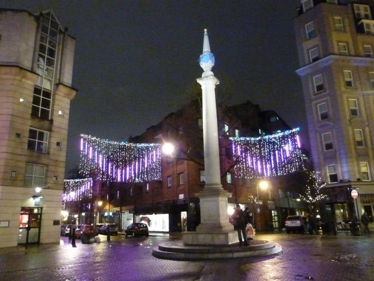 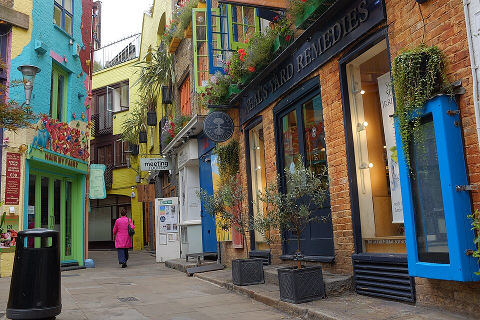

  

ℹ️ Achtergrond & tips: Seven Dials

  🔗 [Wikipedia](https://en.wikipedia.org/wiki/Seven_Dials,_London)
  🏛️ **Historie:** Aangelegd rond 1690 door Thomas Neale; de zuil met de zonnewijzers heeft eigenlijk maar 6 wijzerplaten in plaats van 7 — een bekende Londense oddity.
  ✅ **Leuk:** onafhankelijke boetiekjes en ontwerperswinkels ontdekken, weg van de grote ketens.
  ⚠️ **Vermijd:** zaterdagmiddag — dan is het er erg druk met shoppers.
  

  

ℹ️ Achtergrond & tips: Neal's Yard

  🔗 [Wikipedia](https://en.wikipedia.org/wiki/Neal%27s_Yard)
  🏛️ **Historie:** Ooit een vervallen achterplaatsje, in de jaren '70 door lokale ondernemers omgetoverd tot het kleurrijke hofje van nu.
  ✅ **Leuk:** perfecte, felgekleurde fotolocatie.
  ⚠️ **Vermijd:** rond het middaguur — dan staat iedereen met de groep te wachten voor dezelfde foto.
  

* **Proeven & Ervaren:** Haal een versgebakken opgerolde pizza of empanada op Seven Dials Market.
* **Avond:** Wandel door de bruisende steegjes van **Soho** en **Chinatown**. Eet een laagdrempelige hap bij een klassieke pub (zoals *The French House* of *The Crown & Two Chairmen*) of een Aziatisch restaurantje.

  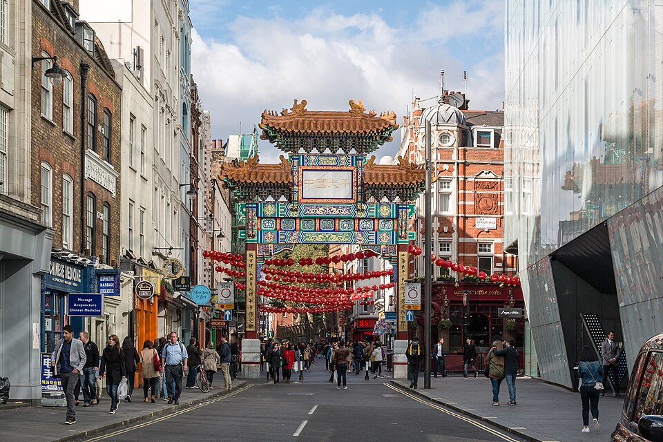

  

ℹ️ Achtergrond & tips: Soho

  🔗 [Wikipedia](https://en.wikipedia.org/wiki/Soho)
  🏛️ **Historie:** Ooit 17e-eeuws jachtgebied ("Soho!" was de jachtkreet); groeide uit tot Londens bohemien en artistieke hart, ook bekend als LGBTQ+-wijk.
  ✅ **Leuk:** rondslenteren tussen platenzaken en vintage winkels.
  ⚠️ **Vermijd:** 's avonds laat door de kleinere zijstraatjes lopen — houd het bij de hoofdstraten.
  

  

ℹ️ Achtergrond & tips: Chinatown

  🔗 [Wikipedia](https://en.wikipedia.org/wiki/Chinatown,_London)
  🏛️ **Historie:** Verhuisde in de jaren '50-'70 van Limehouse (East End) naar Soho na oorlogsschade; de decoratieve poorten zijn een geschenk van de Chinese overheid.
  ✅ **Leuk:** dim sum proeven bij een van de kleinere, authentiekere zaakjes.
  ⚠️ **Vermijd:** de grote, drukke restaurants direct aan Gerrard Street — vaak toeristenprijzen voor middelmatige kwaliteit.
  

  📅 *Reserveren:* pubs zijn walk-in (geen reservering nodig/mogelijk); Chinatown-restaurants raden we aan rond 19:00 te bezoeken om drukte te vermijden.

[⬆️ Terug naar boven](#top)

---

#### **Zaterdag 1 augustus: Iconische Highlights & Het Reuzenrad** *(~4,5 km wandelen)*

> 🕒 **Openingstijden:** London Eye doorgaans 10:00-20:30 in augustus (tijdslot-afhankelijk, check bij boeking) · Tate Modern 10:00-18:00 (bevestigd).
> 🍳 **Ontbijt:** *Kaffeine* (Great Titchfield Street), 8 min lopen van het hotel — uitstekende koffie & pastries (~£6-9 p.p.).
> ☔ **Bij regen:** Ruil het London Eye voor een latere/andere dag (weinig zicht bij mist/regen) en ga direct door naar **Tate Modern** (gratis, overdekt) — bewaar het Eye voor een heldere dag deze week.

🗺️ **Route** *(te voet, scenic route langs Trafalgar Square en de Theems)*

| | Van → Naar | Afstand | Tijd | Kaart |
|---|---|---|---|---|
| 🚶 | Hotel → Big Ben / Westminster *(alt. 🚇 Bakerloo-lijn Oxford Circus→Charing Cross, ~10 min)* | 2,6 km | 35 min | [Route](https://www.google.com/maps/dir/?api=1&origin=STG%20Hotel%20Oxford%20Street%20London&destination=Big%20Ben%20London&travelmode=walking) |
| 🚶 | Westminster → London Eye | 0,6 km | 5 min | [Route](https://www.google.com/maps/dir/?api=1&origin=Big%20Ben%20London&destination=London%20Eye&travelmode=walking) |
| 🚶 | London Eye → Tate Modern *(langs de Theems, Southbank)* | 1,9 km | 25 min | [Route](https://www.google.com/maps/dir/?api=1&origin=London%20Eye&destination=Tate%20Modern&travelmode=walking) |

* **Ochtend:** Wandel naar Westminster. Bekijk de **Big Ben**, **Parliament Square** en **Westminster Abbey** van buiten.

  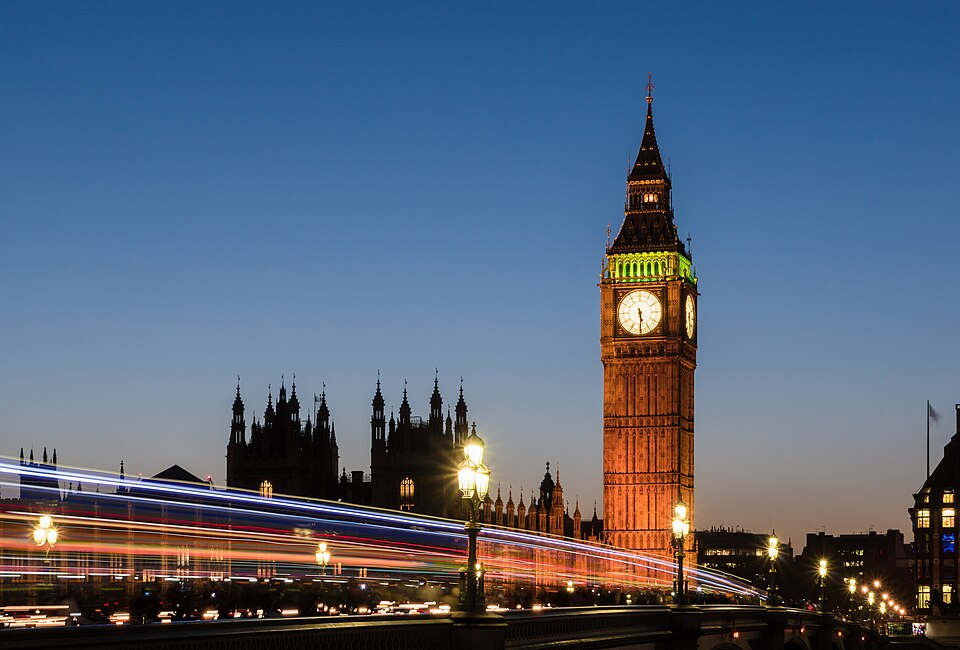

  

ℹ️ Achtergrond & tips: Big Ben / Elizabeth Tower

  🔗 [Wikipedia](https://en.wikipedia.org/wiki/Elizabeth_Tower)
  🏛️ **Historie:** "Big Ben" is eigenlijk de naam van de grote bel, niet de toren; gebouwd na de brand van het parlement in 1834, voltooid in 1859.
  ✅ **Leuk:** mooiste foto vanaf Westminster Bridge, vooral bij zonsondergang.
  ⚠️ **Vermijd:** geen binnenbezoek plannen — dat kan alleen voor UK-inwoners via hun parlementslid.
  

* **Middag:** Steek de Westminster Bridge over naar de South Bank en stap in het **London Eye**. Wandel daarna langs de Theems via de *Southbank Centre Food Market* (proef streetfood zoals chorizo rolls of bao buns) richting de **Tate Modern**.

  🍽️ *Lunch:* **Southbank Centre Food Market** — divers streetfood-aanbod, reken op ~£10-14 p.p.

  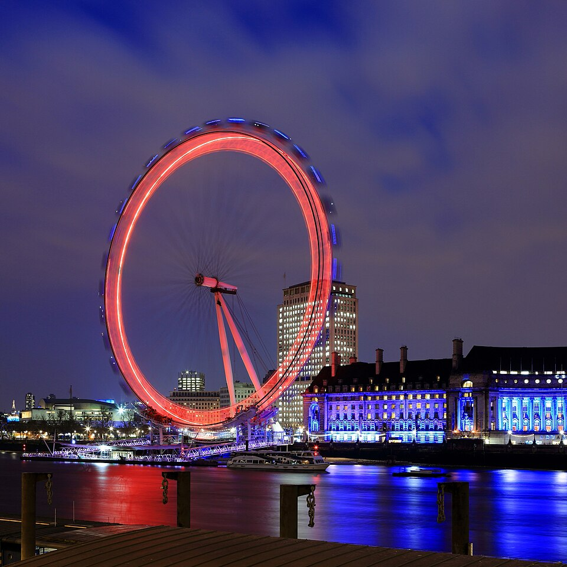 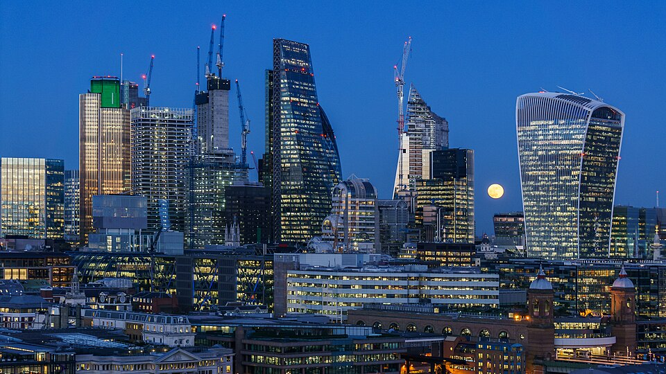

  

ℹ️ Achtergrond & tips: London Eye

  🔗 [Wikipedia](https://en.wikipedia.org/wiki/London_Eye)
  🏛️ **Historie:** Gebouwd voor de millenniumviering (1999-2000), oorspronkelijk bedoeld als tijdelijke attractie voor 5 jaar.
  ✅ **Leuk:** boek het laatste tijdslot van de dag voor zonsondergang/nachtzicht over de stad.
  ⚠️ **Vermijd:** bewolkte of regenachtige dagen — dan is het uitzicht amper de moeite waard.
  

  

ℹ️ Achtergrond & tips: Tate Modern

  🔗 [Wikipedia](https://en.wikipedia.org/wiki/Tate_Modern)
  🏛️ **Historie:** Voormalige Bankside elektriciteitscentrale, in 2000 omgebouwd tot museum voor moderne kunst.
  ✅ **Leuk:** gratis panoramaterras op de 10e verdieping (Blavatnik Building) met uitzicht over de Theems.
  ⚠️ **Vermijd:** proberen alles in één bezoek te zien — het museum is enorm, kies vooraf 1-2 verdiepingen.
  

* **Avond:** Diner met de groep bij een sfeervolle en betaalbare brasserie, zoals *Dishoom* (stijlvol Indiaas streetfood, geweldige prijs-kwaliteit) of *Honest Burgers*.

  📅 *Reserveren:* [Dishoom](https://www.dishoom.com) accepteert geen reserveringen voor kleine groepen (walk-in, vaak wachtrij) — kom rond 18:00 voor de deur; [Honest Burgers](https://www.honestburgers.co.uk) wél online reserveerbaar, zeker doen in augustus.

[⬆️ Terug naar boven](#top)

---

#### **Zondag 2 augustus: Historie, Beroemde Markten & Verborgen Steegjes** *(~4,5 km wandelen + metro)*

> 🕒 **Openingstijden:** Tower of London dagelijks 09:00-17:30 (laatste toegang 16:00, bevestigd) · Borough Market ma-wo beperkt, do-za 10:00-17:00, zo 10:00-16:00 (check voor vertrek) · Leadenhall Market ma-vr overdag, in het weekend rustiger.
> 🍳 **Ontbijt:** *The Attendant* (Foley Street), 6 min lopen van het hotel — sfeervol ingericht in een voormalig Victoriaans openbaar toilet (~£8-12 p.p.).
> ☔ **Bij regen:** Borough Market en Leadenhall Market zijn overdekt — prima schuilplek; combineer eventueel met de (overdekte) Tower of London zelf iets langer bezoeken.

🗺️ **Route** *(hotel→Tower per metro, rest te voet — 6 km lopen is te ver)*

| | Van → Naar | Afstand | Tijd | Kaart |
|---|---|---|---|---|
| 🚇 | Hotel → Tower of London *(Central lijn Oxford Circus→Bank, overstap Circle/District→Tower Hill)* | 6,0 km | ~20 min | [Route](https://www.google.com/maps/dir/?api=1&origin=STG%20Hotel%20Oxford%20Street%20London&destination=Tower%20of%20London&travelmode=transit) |
| 🚶 | Tower of London → Leadenhall Market | 0,9 km | 10 min | [Route](https://www.google.com/maps/dir/?api=1&origin=Tower%20of%20London&destination=Leadenhall%20Market&travelmode=walking) |
| 🚶 | Leadenhall Market → Borough Market *(via London Bridge)* | 1,2 km | 15 min | [Route](https://www.google.com/maps/dir/?api=1&origin=Leadenhall%20Market&destination=Borough%20Market&travelmode=walking) |
| 🚶 | Borough Market → St Bartholomew-the-Great *(via Millennium Bridge & Barbican)* | 2,1 km | 25 min | [Route](https://www.google.com/maps/dir/?api=1&origin=Borough%20Market&destination=St%20Bartholomew-the-Great%20London&travelmode=walking) |
| 🚶 | St Bartholomew-the-Great → Clerkenwell Close | 0,6 km | 5 min | [Route](https://www.google.com/maps/dir/?api=1&origin=St%20Bartholomew-the-Great%20London&destination=Clerkenwell%20Close%20London&travelmode=walking) |

* **Ochtend:** Bezoek de **Tower of London** (bekijk de Kroonjuwelen en de historische vesting).

  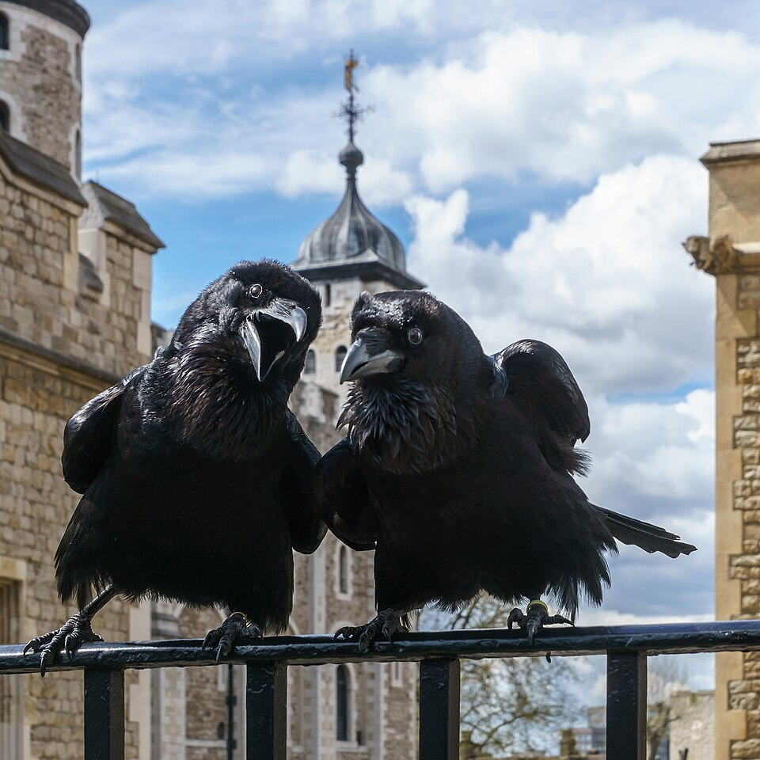

  

ℹ️ Achtergrond & tips: Tower of London

  🔗 [Wikipedia](https://en.wikipedia.org/wiki/Tower_of_London)
  🏛️ **Historie:** Gebouwd door Willem de Veroveraar rond 1078; diende als paleis, gevangenis en executieplaats (o.a. Anne Boleyn).
  ✅ **Leuk:** gratis rondleiding door een Yeoman Warder (Beefeater), elke ~30 min, vermakelijk én informatief.
  ⚠️ **Vermijd:** zonder voorafgeboekt tijdslot komen — de rijen aan de kassa kunnen uren duren.
  

* **Middag:** Wandel naar **Leadenhall Market** (bekend uit Harry Potter) en vervolg de route naar **Borough Market**, de beroemdste culinaire markt van Londen. Proef hier onder meer *Crosstown Doughnuts*, *Kappacasein grilled cheese* of verse pasta bij *Padella*.

  🍽️ *Lunch:* **Borough Market** — proef bij meerdere kraampjes, reken op ~£15-25 p.p. (zie ook kostenraming).

  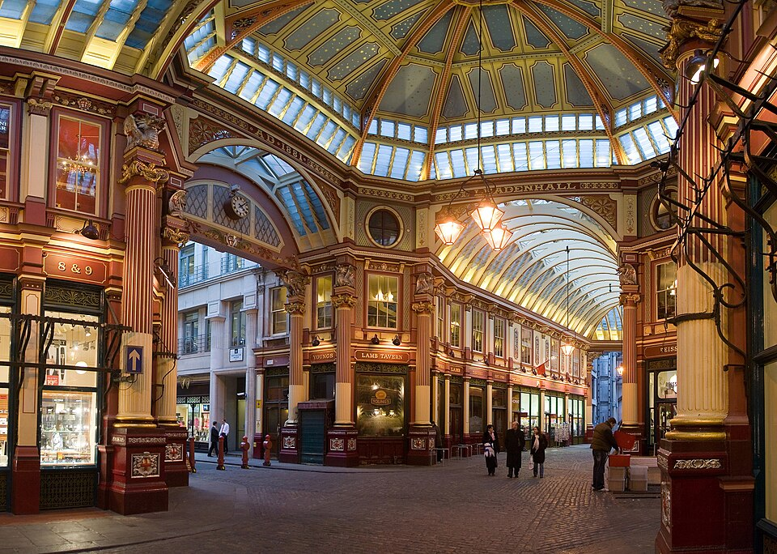 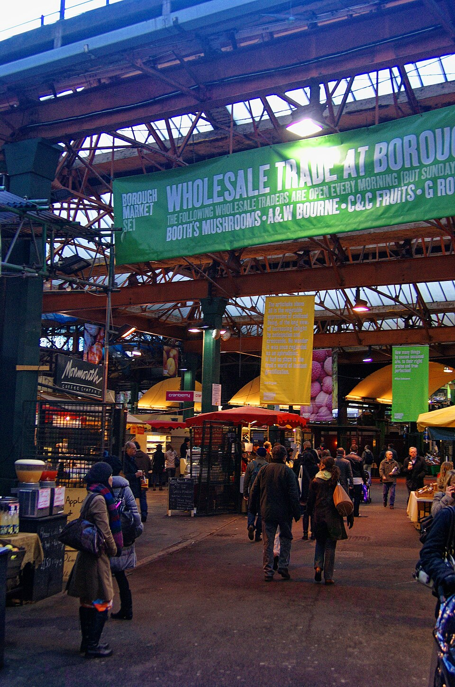

  

ℹ️ Achtergrond & tips: Leadenhall Market

  🔗 [Wikipedia](https://en.wikipedia.org/wiki/Leadenhall_Market)
  🏛️ **Historie:** Victoriaanse overdekte markt uit 1881, gebouwd op de plek van het oude Romeinse forum van Londinium; filmlocatie voor de Wegisstraat in Harry Potter.
  ✅ **Leuk:** bewonder het Victoriaanse ijzer- en glaswerk — erg fotogeniek.
  ⚠️ **Vermijd:** doordeweeks na kantoortijd — dan zijn de meeste winkels al gesloten.
  

  

ℹ️ Achtergrond & tips: Borough Market

  🔗 [Wikipedia](https://en.wikipedia.org/wiki/Borough_Market)
  🏛️ **Historie:** Bestaat al sinds de 12e eeuw — een van de oudste voedselmarkten van Londen.
  ✅ **Leuk:** proef bij meerdere kraampjes in plaats van één grote maaltijd, zo proef je meer variatie.
  ⚠️ **Vermijd:** zaterdagmiddag — dan is het er extreem druk; kom liever vroeg in de ochtend.
  

* **Namiddag:** Bekijk de **St. Bartholomew-the-Great** (de oudste kerk van Londen, verborgen in Smithfield) en het nabijgelegen rustige hofje **Clerkenwell Close**.

  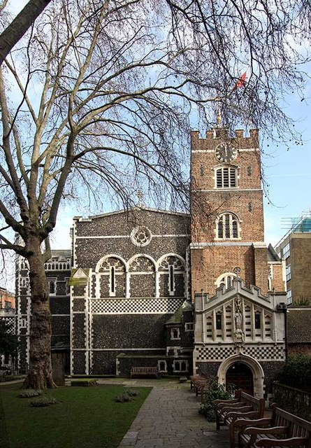

  

ℹ️ Achtergrond & tips: St Bartholomew-the-Great

  🔗 [Wikipedia](https://en.wikipedia.org/wiki/St_Bartholomew-the-Great)
  🏛️ **Historie:** Gesticht in 1123, de oudste nog functionerende kerk van Londen; filmlocatie voor o.a. *Four Weddings and a Funeral* en *Shakespeare in Love*.
  ✅ **Leuk:** de sfeervolle Normandische architectuur, zeldzaam bewaard gebleven in Londen.
  ⚠️ **Vermijd:** check vooraf of er geen dienst of concert is — dan is bezichtiging beperkt.
  

  

ℹ️ Achtergrond & tips: Clerkenwell Close

  🔗 [Wikipedia](https://en.wikipedia.org/wiki/Clerkenwell)
  🏛️ **Historie:** Middeleeuwse wijk, vernoemd naar de "Clerks' Well" — een put waar geestelijken ooit mysteriespelen opvoerden.
  ✅ **Leuk:** rustige, groene hoek weg van de drukte om even te zitten.
  ⚠️ **Vermijd:** hier winkels/horeca verwachten — het is vooral een woonbuurt.
  

* **Avond:** Informeel diner met de groep bij een historisch eethuis of gastro-pub (bijv. *The Anchor Bankside* aan het water).

  📅 *Reserveren:* [The Anchor Bankside](https://www.taylor-walk.co.uk/pub-details/9484/the-anchor-bankside) — reserveer vooraf voor een tafel met theemszicht, zeker in het weekend.

[⬆️ Terug naar boven](#top)

---

#### **Maandag 3 augustus: Cultuur op Loopafstand & Sfeervol Covent Garden** *(~2,5 km wandelen)*

> 🕒 **Openingstijden:** British Museum dagelijks 10:00-17:00, laatste toegang 16:45 (bevestigd; vrijdag tot 20:30).
> 🍳 **Ontbijt:** *Notes Coffee Roasters* (Soho), 10 min lopen van het hotel — goede espresso en verse broodjes (~£6-9 p.p.).
> ☔ **Bij regen:** Ideale regendag — British Museum is volledig overdekt en Covent Garden's markthal biedt ook beschutting.

🗺️ **Route** *(volledig te voet)*

| | Van → Naar | Afstand | Tijd | Kaart |
|---|---|---|---|---|
| 🚶 | Hotel → British Museum | 1,5 km | 20 min | [Route](https://www.google.com/maps/dir/?api=1&origin=STG%20Hotel%20Oxford%20Street%20London&destination=British%20Museum%20London&travelmode=walking) |
| 🚶 | British Museum → Covent Garden *(via Bloomsbury)* | 1,1 km | 15 min | [Route](https://www.google.com/maps/dir/?api=1&origin=British%20Museum%20London&destination=Covent%20Garden%20London&travelmode=walking) |

* **Ochtend:** Wandel in 5 minuten van het hotel naar het **British Museum** (mummiecollectie, Steen van Rosetta).

  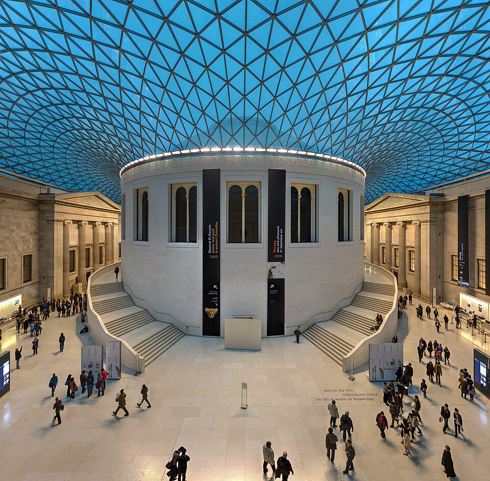

  

ℹ️ Achtergrond & tips: British Museum

  🔗 [Wikipedia](https://en.wikipedia.org/wiki/British_Museum)
  🏛️ **Historie:** Geopend in 1759, een van de oudste musea ter wereld; bevat omstreden stukken zoals de Elgin Marbles en de Steen van Rosetta.
  ✅ **Leuk:** de Great Court met glazen dak (het grootste overdekte plein van Europa) is al een bezienswaardigheid op zich.
  ⚠️ **Vermijd:** proberen het hele museum in één ochtend te doen — kies vooraf 2-3 hoogtepunten.
  

* **Middag:** Struin door de antiek- en kunststeegjes van **Bloomsbury** en wandel naar **Covent Garden**. Bekijk de straatartiesten op het overdekte plein en wandel door de historische **Somerset House courtyard**.

  🍽️ *Lunch:* **Homeslice** of **Franco Manca** (pizza, Covent Garden/Seven Dials) — betaalbaar en snel, ~£10-13 p.p.

  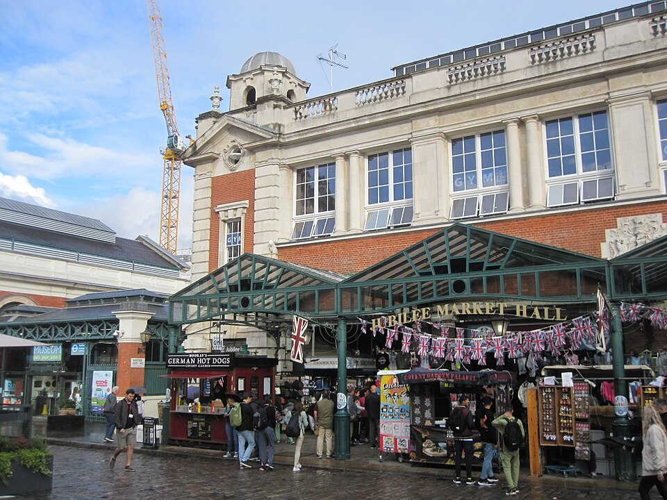

  

ℹ️ Achtergrond & tips: Covent Garden

  🔗 [Wikipedia](https://en.wikipedia.org/wiki/Covent_Garden)
  🏛️ **Historie:** Ooit Londens grootste groente- en fruitmarkt (tot 1974); de naam komt van "Convent Garden" (kloostertuin).
  ✅ **Leuk:** gratis straattheater/acrobatiek op het plein, vaak meerdere keren per dag.
  ⚠️ **Vermijd:** de restaurants direct op het plein zelf — vaak overprijsd; loop een paar straten verder voor betere prijs-kwaliteit.
  

* **Avond:** Diner bij *Seven Dials Market* of een traditionele pie & mash bij *The Ivy Market Grill* (goede prijs-kwaliteitverhouding als je vooraf reserveert).

  📅 *Reserveren:* [The Ivy Market Grill](https://ivycollection.com/restaurants-near-me/the-ivy-london/the-ivy-market-grill-covent-garden/) — populair, boek minimaal enkele dagen vooraf voor een tafel van 4.

[⬆️ Terug naar boven](#top)

---

#### **Dinsdag 4 augustus: Koninklijke Parken & Charmante Wijken** *(~5 km wandelen)*

> 🕒 **Openingstijden:** Wallace Collection dagelijks 10:00-17:00 (gratis, check voor vertrek) · Buckingham Palace alleen buitenkant te bezichtigen (geen tijdslot nodig).
> 🍳 **Ontbijt:** *Fernandez & Wells* (Marylebone Lane), 12 min lopen van het hotel — Spaans-geïnspireerd ontbijt, populair bij locals (~£8-11 p.p.).
> ☔ **Bij regen:** Wallace Collection (gratis, overdekt) naar voren halen in het programma; St James's Park/Mayfair-wandeling later op de dag doen als het opklaart.

🗺️ **Route** *(volledig te voet)*

| | Van → Naar | Afstand | Tijd | Kaart |
|---|---|---|---|---|
| 🚶 | Hotel → St James's Park | 1,9 km | 25 min | [Route](https://www.google.com/maps/dir/?api=1&origin=STG%20Hotel%20Oxford%20Street%20London&destination=St%20James%27s%20Park%20London&travelmode=walking) |
| 🚶 | St James's Park → Buckingham Palace | 0,7 km | 10 min | [Route](https://www.google.com/maps/dir/?api=1&origin=St%20James%27s%20Park%20London&destination=Buckingham%20Palace&travelmode=walking) |
| 🚶 | Buckingham Palace → Wallace Collection *(door Mayfair; alt. 🚌 bus richting Marylebone)* | 2,5 km | 30 min | [Route](https://www.google.com/maps/dir/?api=1&origin=Buckingham%20Palace&destination=Wallace%20Collection%20London&travelmode=walking) |

* **Ochtend:** Wandel door **St. James's Park** richting **Buckingham Palace**. Ontdek de rustige historische wijk **Mayfair** en de verborgen passage *Grays Antiques*.

   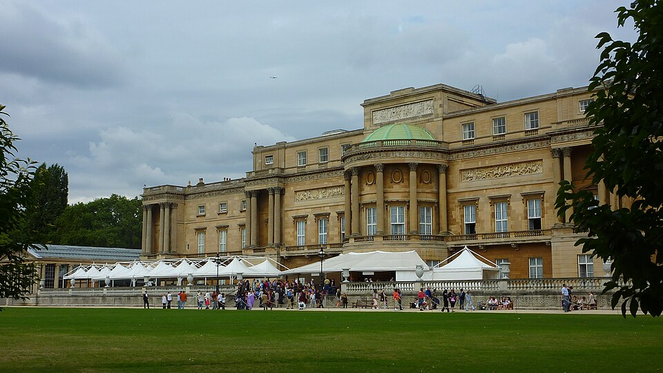

  

ℹ️ Achtergrond & tips: St James's Park

  🔗 [Wikipedia](https://en.wikipedia.org/wiki/St_James%27s_Park)
  🏛️ **Historie:** Oudste Koninklijke Park van Londen (16e eeuw), ooit moerasgebied onder Hendrik VIII.
  ✅ **Leuk:** pelikanen voeren gebeurt doorgaans rond 14:30 bij de vijver.
  ⚠️ **Vermijd:** picknicken vlak voor Buckingham Palace tijdens de Changing of the Guard — dan is het er stampvol.
  

  

ℹ️ Achtergrond & tips: Buckingham Palace

  🔗 [Wikipedia](https://en.wikipedia.org/wiki/Buckingham_Palace)
  🏛️ **Historie:** Sinds 1837 officiële Londense residentie van de Britse monarch; oorspronkelijk een landhuis (Buckingham House) uit 1703.
  ✅ **Leuk:** de Changing of the Guard (check actuele dagen/tijden online) is gratis en spectaculair met een goede plek.
  ⚠️ **Vermijd:** vlak voor de wisseling van de wacht aankomen — sta minstens 45 min van tevoren vooraan.
  

* **Middag:** Bezoek het indrukwekkende **Wallace Collection** museum (een gratis toegankelijk herenhuis vol kunst en harnassen) of ontdek de boetiekstraatjes van **Marylebone High Street**.

  🍽️ *Lunch:* **Ginger & White** of **La Fromagerie** (Marylebone High Street) — gezellige buurtcafés, ~£12-16 p.p.

  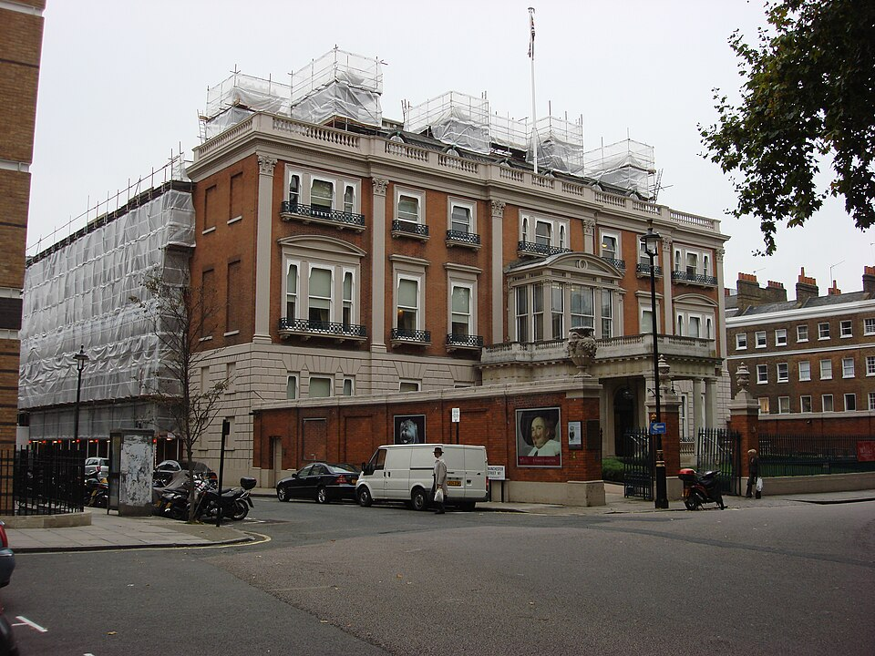

  

ℹ️ Achtergrond & tips: Wallace Collection

  🔗 [Wikipedia](https://en.wikipedia.org/wiki/Wallace_Collection)
  🏛️ **Historie:** Privécollectie van de familie Hertford-Wallace, in 1897 aan de natie nagelaten onder voorwaarde dat niets ooit wordt uitgeleend of toegevoegd.
  ✅ **Leuk:** indrukwekkende wapen- en harnascollectie, favoriet bij kinderen.
  ⚠️ **Vermijd:** flitsfotografie bij de schilderijen — schadelijk voor de doeken.
  

* **Avond:** Groepsdiner bij een gezellige Italiaan of traditionele pub met *Sunday Roast* (bijv. *The Grazing Goat* in Marylebone).

  📅 *Reserveren:* [The Grazing Goat](https://www.cubitthouse.co.uk/the-grazing-goat-boutique-hotel-marylebone/) — reserveer online vooraf, vooral in het weekend erg gewild.

[⬆️ Terug naar boven](#top)

---

#### **Woensdag 5 augustus: Afsluiting & Vertrek** *(~4 km wandelen + metro)*

> 🚄 **Vertrek Eurostar St Pancras: 16:54.** Check-in/paspoortcontrole opent ~90 min van tevoren — wees uiterlijk 15:15 op het station, dit programma brengt je er al rond 14:15-14:30 (ruime buffer).
> 🍳 **Ontbijt:** *Pret A Manger* bij het hotel — snel en simpel, past bij de strakke ochtend (~£5-7 p.p.).
> ☔ **Bij regen:** Ruil Regent's Park voor Camden Market zelf (overdekte hallen) als vertrekpunt van de ochtend.

🗺️ **Route** *(park & Camden te voet, terug naar hotel en naar St Pancras per metro — sneller met bagage)*

| | Van → Naar | Afstand | Tijd | Kaart |
|---|---|---|---|---|
| 🚶 | Hotel (09:30) → Regent's Park | 2,2 km | 30 min | [Route](https://www.google.com/maps/dir/?api=1&origin=STG%20Hotel%20Oxford%20Street%20London&destination=Regent%27s%20Park%20London&travelmode=walking) |
| 🚶 | Regent's Park (~11:00) → Camden Town | 1,8 km | 20 min | [Route](https://www.google.com/maps/dir/?api=1&origin=Regent%27s%20Park%20London&destination=Camden%20Town%20London&travelmode=walking) |
| 🚇 | Camden Town (~13:30) → Hotel (bagage ophalen) *(Northern lijn Camden Town→Oxford Circus)* | 3,4 km | ~10 min | [Route](https://www.google.com/maps/dir/?api=1&origin=Camden%20Town%20London&destination=STG%20Hotel%20Oxford%20Street%20London&travelmode=transit) |
| 🚇 | Hotel (~14:00) → St Pancras International *(Victoria lijn Oxford Circus→King's Cross St Pancras, handig met bagage)* | 2,8 km | ~10 min | [Route](https://www.google.com/maps/dir/?api=1&origin=STG%20Hotel%20Oxford%20Street%20London&destination=St%20Pancras%20International%20London&travelmode=transit) |

* **Ochtend (09:30-11:00):** Laat de bagage bij het hotel en wandel door **Regent's Park**.

  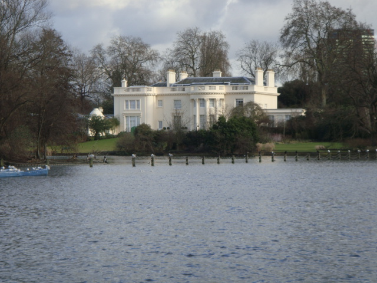 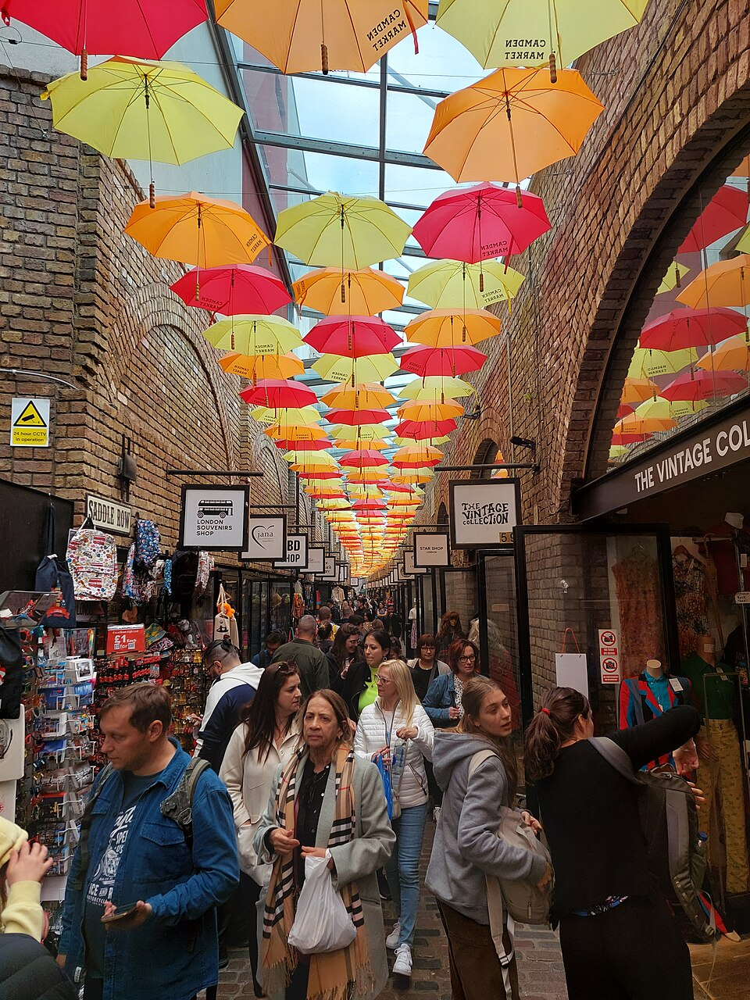

  

ℹ️ Achtergrond & tips: Regent's Park

  🔗 [Wikipedia](https://en.wikipedia.org/wiki/Regent%27s_Park)
  🏛️ **Historie:** Ontworpen door architect John Nash in opdracht van prins-regent George IV (vandaar de naam), aangelegd rond 1811-1835.
  ✅ **Leuk:** Queen Mary's Gardens heeft een van de grootste rozentuinen van Londen — bloeit precies rond juli/augustus.
  ⚠️ **Vermijd:** London Zoo (in het park) apart inplannen zonder tijd te reserveren — kost extra entree en minstens een halve dag.
  

  

ℹ️ Achtergrond & tips: Camden Town

  🔗 [Wikipedia](https://en.wikipedia.org/wiki/Camden_Town)
  🏛️ **Historie:** Ontwikkelde zich in de 19e eeuw rond kanaal en spoorwegen; werd in de jaren '70-'80 het hart van Londens punk- en alternatieve scene.
  ✅ **Leuk:** Camden Lock Market en de wandeling langs Regent's Canal zijn erg sfeervol.
  ⚠️ **Vermijd:** te-mooi-om-waar-te-zijn aanbiedingen van straatverkopers rond het station — veel toeristenvallen.
  

* **Late ochtend/lunch (11:20-13:30):** Verken **Camden Town** (markt, lunch aan het kanaal).

  🍽️ *Lunch:* **Camden Market foodstalls** — enorme variatie streetfood langs Regent's Canal, ~£8-12 p.p.
* **Middag (13:30-14:15):** Metro terug naar het hotel om de bagage op te halen, dan metro naar **St Pancras International** — aankomst ruim voor het vertrek van 16:54.

[⬆️ Terug naar boven](#top)

---

### 🎟️ Ticketgids, Boekingstips & Kostenraming (per persoon)

| Activiteit / Bezienswaardigheid | Type Ticket | Prijs p.p. (indicatie) | Aankooptip |
| --- | --- | --- | --- |
| **London Eye** | Standaard tijdslot | ~£30 - £42 | **Vooraf online boeken.** Kies het vroegste tijdslot van de dag om lange wachtrijen te vermijden. |
| **Tower of London** | Standaard toegang | ~£34 - £35 | **Vooraf online boeken.** Inclusief toegang tot de Kroonjuwelen en rondleiding door de Yeoman Warders (Beefeaters). |
| **British Museum** | Algemene toegang | **Gratis** | **Tijdslot reserveren.** Hoewel de toegang gratis is, is een vooraf gereserveerd online tijdslot sterk aanbevolen om wachttijd bij de ingang te voorkomen. |
| **Wallace Collection** | Algemene toegang | **Gratis** | Vrije inloop (geen ticket nodig). |
| **Westminster Abbey (Buitenzijde)** | N.v.t. | **Gratis** | Prachtig vanaf het plein te bewonderen zonder ticket. *(Binnenbezoek kost ca. £29 p.p. indien gewenst)* |
| **Borough Market & Markten** | Vrije toegang | Afhankelijk van consumptie | Reken op ca. £15 - £25 p.p. voor het proeven van diverse kleine gerechten en hapjes op de markt. |
| **Openbaar vervoer (metro/bus)** | Contactless dagcap | ~£8,50 p.p. per dag (max.) | Alleen nodig op dag 3 (Tower) en dag 6 (vertrek) — overige dagen volledig te voet. |

### 💡 Extra Tips voor Waarde & Gemak

* **Betalen & OV:** Gebruik voor de metro/bus eenvoudig een contactloze bankpas of creditcard (Oyster card is niet meer nodig).
* **Groepsdiner (4 personen):** Keten-restaurants zoals *Dishoom*, *Flat Iron* (uitstekende biefstuk voor ~£15) en *Pizza Pilgrims* bieden een erg hoge kwaliteit tegen zeer redelijke prijzen. Reserveer voor de avonden tijdig om wachttijden met 4 personen te voorkomen.
* **Fooien:** in restaurants wordt vaak automatisch 12,5% "optional service charge" op de rekening gezet — check de bon, dan hoeft er niets extra bij. Staat er niets op, dan is 10-12,5% gebruikelijk bij goede service. Bij pubs/counterservice (bestellen aan de bar) wordt geen fooi verwacht. Bij taxi's is afronden naar boven gebruikelijk.
